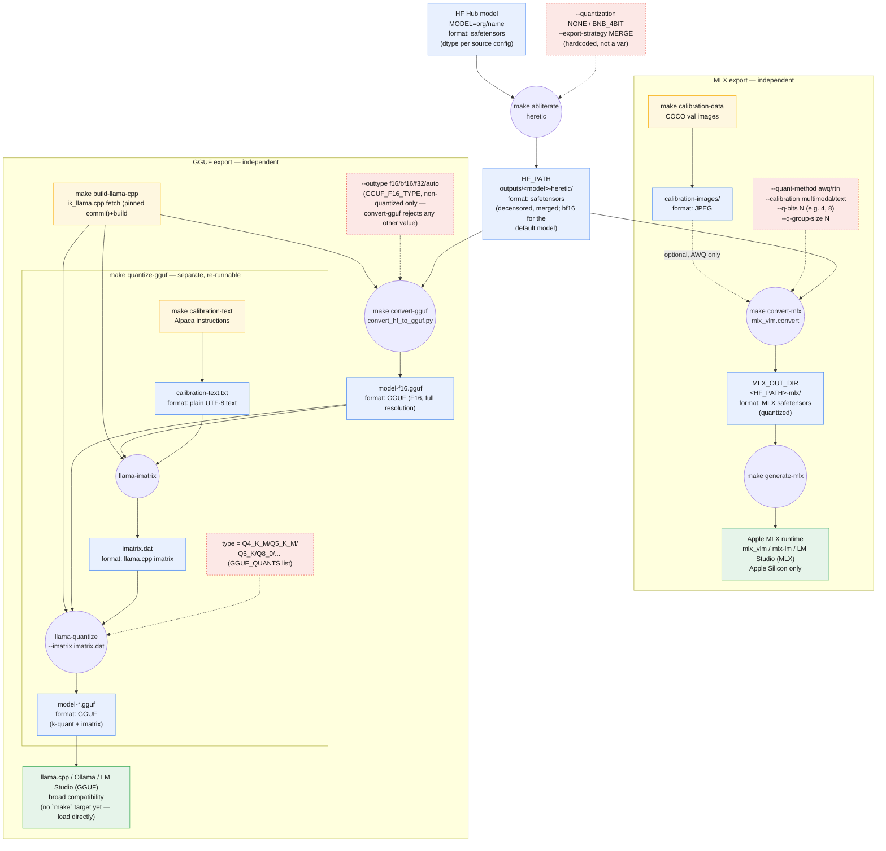

# Wellspring: Heretic → MLX / GGUF Export Pipeline

Decensors a Hugging Face language model with [Heretic](https://github.com/p-e-w/heretic)
(automatic abliteration), then exports the result to two independent,
locally-runnable formats:

- **MLX** — quantized via mlx-vlm's AWQ calibration, for Apple Silicon (`mlx_vlm` / `mlx-lm` / LM Studio's MLX backend)
- **GGUF** — imatrix-quantized via [`ik_llama.cpp`](https://github.com/ikawrakow/ik_llama.cpp), for `llama.cpp` / Ollama / LM Studio's GGUF backend

The two export paths never feed into each other — same source checkpoint in, completely separate calibration data, tools, and output directories.

## Provenance & attribution

For external audits: every external code, model, and dataset dependency
this pipeline touches — exact versions/commits, licenses, and reproduction
steps — is documented in **[`PROVENANCE.md`](PROVENANCE.md)** (chain of
custody: model/dataset commits, per-run manifests) and
**[`THIRD_PARTY_NOTICES.md`](THIRD_PARTY_NOTICES.md)** (code dependencies
and their licenses, including one AGPL and one CC-BY-NC-4.0 flag worth
reading before commercial use). `make lock` and `make notices` regenerate
the two machine-readable artifacts those documents summarize
(`requirements-lock.txt`, `third_party_licenses.json`).

## Governance

Project principles (provenance discipline, atomic operations, license
awareness, simplicity-first) are codified in
[`.specify/memory/constitution.md`](.specify/memory/constitution.md). It
supersedes other docs on governance questions; this README, `PROVENANCE.md`,
and `ROADMAP.md` remain the authoritative operational references it points to.

## Requirements

This pipeline supports two tracks, depending on your hardware. Both run the
same `make abliterate` step; they differ only in which export target(s) are
available afterward.

### Track A — macOS / Apple Silicon

Full pipeline: heretic abliteration + MLX export + GGUF export.

- macOS on Apple Silicon (MLX conversion needs it; the abliteration step uses the Metal backend)
- Python 3.14 (`.python-version` pins this; install via `brew install python@3.14` if needed)
- Homebrew `cmake` + `ninja` — only needed for the GGUF export path (`make build-llama-cpp`)
- Disk: the heretic checkpoint alone is ~72GB (bf16) for the default model (`Qwen/Qwen3.6-35B-A3B`); budget for that plus whichever export(s) you run (MLX quantized copy, and/or GGUF F16 + quantized copies)

### Track B — Linux + NVIDIA GPU (e.g. AWS EC2)

heretic abliteration + GGUF export only. **MLX is not available** on this
track — `mlx-vlm` is Apple/Metal only, and `convert-mlx`/`generate-mlx` now
fail fast with a clear error message (instead of an obscure "command not
found") if you run them here; use `make convert-gguf && make quantize-gguf`
instead.

- A Linux instance with an NVIDIA GPU (e.g. an EC2 `g5`/`g6e`/`p4d`/`p5`
  instance) and an up-to-date NVIDIA driver
- Python 3.14 — no Homebrew on Linux, so install via `pyenv`, `uv`, or the
  `deadsnakes` PPA (Ubuntu) instead
- `sudo apt-get install cmake ninja-build` — needed for the GGUF export
  path (`make build-llama-cpp`)
- An NVIDIA driver + CUDA toolkit (`nvcc` on `PATH`) for the new
  `GGML_CUDA` build path below — or use an
  [AWS Deep Learning AMI](https://aws.amazon.com/machine-learning/amis/),
  which ships these preinstalled
- The default PyPI `torch` wheel on Linux already includes CUDA support
  for common CUDA versions, so `pip install torch` (via `make setup`)
  normally needs no special index URL — only reach for the
  [pytorch.org selector](https://pytorch.org/get-started/locally/) if you
  need an unusual CUDA version or ROCm
- Disk: see "Disk sizing on EC2" below

The Makefile auto-detects an NVIDIA GPU via `nvidia-smi` and, when present,
builds `ik_llama.cpp` with CUDA enabled (`GGML_CUDA=ON`) and GPU-offloads
the imatrix pass — see "Key variables" below for `GGML_CUDA`,
`CUDA_ARCHITECTURES`, and `LLAMA_NGL`.

**GPU-architecture auto-detection — recommend CMake >=3.24 + CUDA toolkit
>=11.6.** The build already passes `-DGGML_NATIVE=ON` unconditionally. On
that combination of toolchain versions, `ik_llama.cpp`'s own CMakeLists
(at the pinned `LLAMA_CPP_REF`) resolves `CMAKE_CUDA_ARCHITECTURES` to
`"native"` — it auto-detects the exact compute capability of the GPU doing
the build, correctly covering H100/H200 (compute capability 90) and
L4/L40s/RTX-40-series (compute capability 89) with zero extra
configuration. On an **older** CMake (<3.24) or CUDA toolkit (<11.6),
though, it silently falls back to a hardcoded architecture list
(`50;61;70;75;80`) that tops out at Ampere/A100 and does **not** include
89 or 90 — a build on an L4/L40s or H100 instance with an older
CMake/CUDA could silently miscompile or underperform for that GPU, with
no warning from the build itself. Check with `cmake --version` /
`nvcc --version`; if you're stuck on an older toolchain, set
`CUDA_ARCHITECTURES` explicitly, e.g. `CUDA_ARCHITECTURES=89` for
L4/L40s/RTX 40-series, or `CUDA_ARCHITECTURES=90` for H100/H200. `make doctor`
checks your cmake/nvcc versions against this exact threshold and warns by
name if a detected GPU needs this. See the `CUDA_ARCHITECTURES` row below
and its Makefile comment for the full source citation.

### Running the full-precision model on large-VRAM / multi-GPU EC2 instances

Keep the default `QUANTIZATION=NONE` — do **not** switch to `BNB_4BIT`
just to make a large model fit; that trades away model quality. heretic's
own default `device_map="auto"` (Hugging Face Accelerate) already
automatically shards the ~72GB bf16 default model (`Qwen/Qwen3.6-35B-A3B`)
across every GPU visible to the process, with zero extra flags required —
this already solves "large model, no quantization" as long as your
instance has enough *combined* VRAM across all its GPUs.

Concrete EC2 instance types with enough combined VRAM to hold that
checkpoint plus working memory (activations, optimizer state during
abliteration, etc.) without quantization:

- `p4d.24xlarge` — 8x A100 40GB = 320GB total VRAM
- `p5.48xlarge` — 8x H100 80GB = 640GB total VRAM

A single-GPU instance (e.g. `g5`/`g6e`) does not have enough VRAM for the
default model at full precision and will need `QUANTIZATION=BNB_4BIT`
instead, if you explicitly accept the quality tradeoff for that model size.

**System RAM on this path**: heretic only loads a full CPU copy of the base
model (for CPU-side merge/dequantization, a ~3x-parameter-count RAM spike
per heretic's own rule of thumb) when `QUANTIZATION=BNB_4BIT` — that spike
does **not** apply to the `QUANTIZATION=NONE` path recommended here.
Accelerate's sharded loading and its `offload_outputs_to_cpu` analysis-tensor
staging still use host RAM transiently on any path, though, so as a simple
rule of thumb, system RAM should comfortably exceed the model's on-disk
size. The `p4d.24xlarge` (1.1TB RAM) / `p5.48xlarge` (2TB RAM) instances
above vastly exceed this for the default ~72GB model, so RAM is not a
binding constraint on those specific instance types.

For advanced per-GPU tuning on a multi-GPU box (e.g. pinning everything to
one device, or capping per-GPU memory on a heterogeneous mix of GPUs), the
Makefile now exposes optional `DEVICE_MAP` and `MAX_MEMORY` passthrough
variables — both empty (no-op) by default, so the default path above is
unchanged unless you explicitly set them. The flag names (`--device-map`/
`--max-memory`) are confirmed correct via heretic's `src/heretic/config.py`
(`cli_kebab_case=True` in its `CliSettingsSource(...)` call — the same
mechanism behind the already-used `--quantization`/`--model-commit`/
`--export-strategy` flags). See "Key variables" below for the `MAX_MEMORY`
value-format example.

Run `make doctor` first to confirm the instance actually has enough
CPU/RAM/disk/VRAM before starting a multi-hour `make abliterate` run.

### Disk sizing on EC2

EC2 default root (EBS) volumes are far smaller than this pipeline needs,
and EC2 instances commonly mount a large data volume separately from a
small root volume.

**Set `HF_HOME` before you run anything.** Hugging Face's model-download
cache defaults to `$HF_HOME`, or `~/.cache/huggingface` if `HF_HOME` is
unset — a location completely independent of this repo's `OUT_DIR`/
`GGUF_OUT_DIR`. If you don't redirect `HF_HOME` to whichever volume
actually has the space, the ~72GB raw model download can silently fill up
a small root volume even though `OUT_DIR`/`GGUF_OUT_DIR` point at plenty
of free space on the big one:

```sh
export HF_HOME=/data/hf-cache   # point at whichever volume has the space
make abliterate
```

For a full GGUF run with the default model and default `GGUF_QUANTS`, the
disk cost breaks down as:

| Component | Size |
|---|---|
| HF Hub raw download cache (`HF_HOME`) | ~72GB |
| heretic's merged `OUT_DIR` export | ~72GB |
| Full-resolution GGUF (F16) | ~72GB |
| `Q4_K_M` quant | ~4.5GB |
| `Q8_0` quant | ~38GB |
| **Total** | **~260GB minimum** |

Budget **at least 400GB** of gp3 EBS (split across `HF_HOME` and the
output volume as appropriate) to leave real headroom for the OS, heretic's
Optuna study checkpoints, logs, and swap. `make doctor` checks free space
at both the pipeline's output path and the resolved HF cache path (and
flags it if they happen to share a filesystem) against this 400GB floor.

## Quick start

```sh
git clone <this-repo-url> && cd wellspring
make setup                                     # create ./.venv, install requirements.txt
make abliterate                                # run heretic against MODEL (default: Qwen/Qwen3.6-35B-A3B)
```

`make setup` best-effort populates `vendor/heretic` too — a read-only,
pinned copy of heretic's own source kept for local reference (e.g.
codegraph indexing). It's optional and never blocks: if you're offline,
building from a tarball with no `.git`, or on a CI runner without git
submodule support, `make setup` warns and continues — the pipeline's
actual runtime dependency is `heretic-llm` from PyPI (installed by the
same `make setup`), not this directory. Populate it manually any time
with `git submodule update --init vendor/heretic`. See `PROVENANCE.md` §5.

`heretic` will interactively ask what to do with the result near the end of
the run (save/upload/chat/benchmark) — choose save, then enter a path (a
natural choice is the one `make help`/the command output suggests). It will
**not** ask you to choose merge-vs-adapter — that's already fixed by
`--export-strategy MERGE` in the Makefile.

Then pick one or both export paths:

```sh
make calibration-data && make convert-mlx      # -> MLX_OUT_DIR, for Apple Silicon
make convert-gguf && make quantize-gguf        # -> GGUF_OUT_DIR, for llama.cpp/Ollama/LM Studio
                                                # (or just `make gguf` to run both in one go)
```

`convert-gguf` and `quantize-gguf` are deliberately separate: `convert-gguf`
does the expensive HF→GGUF pass once and writes a full-resolution
(unquantized) GGUF; `quantize-gguf` reads that file back in and produces the
actual quant levels (`GGUF_QUANTS`, default `Q4_K_M Q8_0`). Want a different
quant level later? Re-run `make quantize-gguf GGUF_QUANTS="..."` — it never
repeats the expensive conversion.

Smoke-test the MLX output:

```sh
make generate-mlx
```

(GGUF has no `make` runtime target yet — load `GGUF_OUT_DIR/model-Q4_K_M.gguf` etc. directly in `llama.cpp`, Ollama, or LM Studio.)

## Pipeline



Every artifact node above (`HF`, `MLX`, `F16`, `GQ`, `CI`, `CTF`) also gets
a sidecar `<name>.provenance.json` recording exactly what produced it
(commits, seeds, parameters) — see [`PROVENANCE.md`](PROVENANCE.md).

## Makefile targets

| Target | Does |
|---|---|
| `make setup` | Create `./.venv` (Python 3.14), install `requirements.txt`, and best-effort populate `vendor/heretic` (never blocks — see `make vendor-heretic`) |
| `make venv` / `make install` | Granular halves of `setup`'s environment setup |
| `make vendor-heretic` | Populate the `vendor/heretic` reference submodule; warns and continues (never fails the build, always exits `0`) if offline, tarball-checked-out, submodules are unsupported, or the remote is unreachable — bounded to `VENDOR_HERETIC_TIMEOUT` seconds (default `20`) rather than hanging on a firewalled/unroutable host |
| `make test` | Run the `pytest` suite (`tests/`) — required to pass before any change touching `scripts/`, per the [constitution](.specify/memory/constitution.md)'s Article IX |
| `make abliterate` | Run `heretic` against `MODEL` with merge pre-selected; you still interactively choose to save and enter a path |
| `make calibration-data` | Fetch `CALIB_SAMPLES` real COCO images into `calibration-images/`, for MLX AWQ calibration |
| `make convert-mlx` | Convert `HF_PATH` → MLX format (`MLX_OUT_DIR`), AWQ-quantized by default |
| `make generate-mlx` | Smoke-test the MLX output with a short generation |
| `make paper` | Fetch the pinned reference paper (Arditi et al. 2024, arXiv:2406.11717v3) into `references/`, plus a tracked `.provenance.json` sidecar; the PDF itself is git-ignored (arXiv non-exclusive license — see `PROVENANCE.md`) |
| `make build-llama-cpp` | Fetch (pinned commit) + build `ik_llama.cpp` (`llama-imatrix`, `llama-quantize`) |
| `make convert-gguf` | Convert `HF_PATH` → full-resolution `GGUF_F16_GGUF` (no quantization); rejects a quantized `GGUF_F16_TYPE` |
| `make calibration-text` | Fetch `CALIB_TEXT_SAMPLES` chat/instruction rows into `calibration-text.txt`, for GGUF imatrix calibration |
| `make quantize-gguf` | imatrix + quantize `GGUF_F16_GGUF` → `GGUF_QUANTS` levels in `GGUF_OUT_DIR`; re-runnable with a different `GGUF_QUANTS` without repeating `convert-gguf` |
| `make gguf` | `convert-gguf`, then (strictly after, even under `make -j`) `quantize-gguf` |
| `make lock` | Freeze exact installed package versions → `requirements-lock.txt` |
| `make notices` | Regenerate the full third-party license manifest → `third_party_licenses.json` |
| `make clean` | Remove `./.venv` |
| `make doctor` | Check CPU/RAM/disk/GPU-VRAM against this pipeline's needs (stdlib-only, runs before `./.venv` exists) — see [`scripts/preflight_check.py`](scripts/preflight_check.py) |

Run `make help` any time for the same summary with your current variable values resolved in.

## Key variables

All have sane defaults; override on the command line, e.g. `make convert-mlx Q_BITS=4`.

| Variable | Default | Meaning |
|---|---|---|
| `MODEL` | `Qwen/Qwen3.6-35B-A3B` | HF model to abliterate |
| `MODEL_COMMIT` | `null` (unpinned) | Exact Hub commit of `MODEL` — deliberately not pinned by default (a fixed SHA is only valid for one specific `MODEL`); see `PROVENANCE.md` §2 for the commit matching the default model |
| `QUANTIZATION` | `NONE` | Heretic load-time quantization (`NONE` \| `BNB_4BIT`) |
| `SEED` | `42` | Heretic's optimizer seed (fixed for reproducible/idempotent re-runs) |
| `GOOD_PROMPTS_COMMIT` / `BAD_PROMPTS_COMMIT` / `GOOD_EVAL_PROMPTS_COMMIT` / `BAD_EVAL_PROMPTS_COMMIT` | pinned commit SHAs | Heretic's own internal optimization/evaluation prompt datasets — see `PROVENANCE.md` §3 |
| `HF_PATH` | `OUT_DIR` (heretic's output) | Shared input to both export paths |
| `QUANT_METHOD` | `awq` | MLX quantization method (`awq` \| `rtn`) |
| `CALIBRATION` | `multimodal` | MLX calibration mode (`multimodal` \| `text`) |
| `Q_BITS` / `Q_GROUP_SIZE` | `8` / `64` | MLX quantization bit-width / group size |
| `CALIB_DATASET` / `CALIB_SPLIT` / `CALIB_SAMPLES` / `CALIB_REVISION` | `detection-datasets/coco` / `val` / `64` / pinned commit | Source for `calibration-images/` — see `PROVENANCE.md` §4 |
| `GGUF_QUANTS` | `Q4_K_M Q8_0` | GGUF quant levels to produce (space-separated list, must be non-empty) |
| `GGUF_F16_TYPE` | `f16` | Intermediate dtype before quantizing — must be `f32`/`f16`/`bf16`/`auto`; `convert-gguf` rejects anything else (an already-quantized outtype would defeat the two-stage design) |
| `GGUF_F16_GGUF` | `GGUF_OUT_DIR/model-<type>.gguf` | Path `quantize-gguf` reads back in; override to point at an existing conversion |
| `CALIB_TEXT_DATASET` / `CALIB_TEXT_SPLIT` / `CALIB_TEXT_SAMPLES` / `CALIB_TEXT_REVISION` | `tatsu-lab/alpaca` / `train` / `100` / pinned commit | Source for `calibration-text.txt` — **`tatsu-lab/alpaca` is CC-BY-NC-4.0, see `PROVENANCE.md` §4** |
| `LLAMA_CPP_REF` | a pinned commit SHA | `ik_llama.cpp` commit `build-llama-cpp` fetches — not the moving default branch |
| `GGML_CUDA` | auto-detected (`ON` if `nvidia-smi` is on `PATH`, else `OFF`) | Whether `build-llama-cpp` builds `ik_llama.cpp` with CUDA support; override `GGML_CUDA=ON`/`OFF` to force either way |
| `CUDA_ARCHITECTURES` | empty (unset) | Optional `-DCMAKE_CUDA_ARCHITECTURES` override, e.g. `"80;86;90"` — left empty by default so ik_llama.cpp's own CMakeLists picks its default target list, which resolves to auto-detected `"native"` on CMake >=3.24 + CUDA toolkit >=11.6, but falls back to a hardcoded list capped at compute capability 80 (missing 89/L4-L40s-RTX40 and 90/H100-H200) on older toolchains — set this explicitly (`89` or `90`) if you're on an older CMake/CUDA and targeting one of those GPUs; see the Track B section above |
| `LLAMA_NGL` | `999` | GPU layers offloaded to `llama-imatrix` when `GGML_CUDA=ON` (999 = all layers, clamped to the model's actual layer count); ignored when `GGML_CUDA=OFF` |
| `DEVICE_MAP` / `MAX_MEMORY` | empty (no-op) | Optional passthrough to heretic's `--device-map`/`--max-memory` for advanced multi-GPU tuning; empty by default so heretic's own `device_map="auto"` (Accelerate auto-sharding across all visible GPUs) is used unchanged. Flag names confirmed via `cli_kebab_case=True` in `src/heretic/config.py`'s `CliSettingsSource(...)` call (same mechanism as `--quantization`/`--model-commit`). `DEVICE_MAP` takes a plain string (`auto`, `balanced`, `sequential`, `cuda:0`, ...). `MAX_MEMORY` takes pydantic-settings' comma-separated dict CLI syntax, e.g. `MAX_MEMORY="0=20GiB,1=20GiB,cpu=64GiB"` (device index or `cpu` as key, size string as value — matches Accelerate's own `max_memory` dict convention) |
| `PAPER_ARXIV_ID` | `2406.11717` | arXiv id (no version suffix) of the reference paper `make paper` fetches — see `PROVENANCE.md` §8 |
| `PAPER_ARXIV_VERSION` | `v3` | Exact arXiv version to pin (the revision being reproduced; arXiv has no commit hashes) |
| `PAPER_TITLE` | the Arditi et al. 2024 title | Paper title recorded in the manifest; override together with the id/version if you retarget it |
| `PAPER_AUTHORS` | the paper's 7 authors | Comma-separated authors recorded in the manifest |
| `PAPER_LICENSE` | `arXiv.org perpetual, non-exclusive license to distribute 1.0` | License recorded in the manifest — **non-permissive**; the PDF stays git-ignored |
| `PAPER_LICENSE_URL` | arXiv's nonexclusive-distrib/1.0 URL | URL of the license text, recorded in the manifest |
| `PAPER_OUT` | `references/<id><version>.pdf` | Where `make paper` writes the PDF (git-ignored); its `.provenance.json` sidecar goes alongside and **is** tracked |
| `PAPER_TIMEOUT` | `60` | Network timeout (seconds) for the paper download |
| `PREFLIGHT_ARGS` | empty | Extra args forwarded to `scripts/preflight_check.py` by `make doctor`, e.g. `PREFLIGHT_ARGS="--require-gpu --min-vram-gb 600"` |

See the `Makefile` itself for the full list and inline rationale comments.

## Notes & caveats

- **Destructive operations are atomic and safe to re-run.** `convert-mlx`,
  `convert-gguf`, and `quantize-gguf`'s imatrix step all write to a sibling
  `.tmp` path/directory first and only replace the previous output via a
  final rename/swap *after* the tool exits successfully — a failed or
  interrupted run (or a missing `mlx_vlm`/`llama-quantize` binary) never
  destroys a previously-good artifact. `quantize-gguf` additionally writes
  every requested quant level to a `.tmp` name, and only clears stale
  levels from a previous, differently-configured run (and renames the new
  ones into place) once *every* requested level has succeeded — a mid-loop
  failure now correctly aborts and reports an error (via `set -e`) instead
  of silently reporting success with a missing quant. Path variables used
  in `rm -rf` (`VENV`, `MLX_OUT_DIR`, `LLAMA_CPP_DIR`) are guarded against
  being empty or `/`/`.` before anything is deleted.
- **`gguf`'s ordering is explicit, not just prerequisite order.** `quantize-gguf`
  is invoked from `gguf`'s recipe (`$(MAKE) quantize-gguf`) rather than
  listed as a second prerequisite, specifically so `make -j gguf` can't run
  it concurrently with `convert-gguf` — Make has no file-based edge between
  two phony targets, so two prerequisites of one target are fair game for
  parallel execution under `-j` even though `quantize-gguf`'s runtime
  existence-check for the F16 file assumes `convert-gguf` already finished.
- **`abliterate`'s `SEED` improves but doesn't guarantee bit-exact reproducibility.**
  It's passed straight to Heretic's `--seed`, which seeds Python's `random`,
  NumPy, PyTorch, and Optuna — removing the dominant source of run-to-run
  variance (Optuna's search order) — but floating-point reduction order on
  GPU/Metal kernels isn't something a seed controls. `MODEL_COMMIT` still
  defaults to unpinned (see above); heretic's 4 internal prompt datasets are
  pinned by default. Treat re-runs as "very likely the same, not
  byte-for-byte guaranteed."
- **`GGUF_F16_TYPE` is intentionally restricted.** `convert_hf_to_gguf.py`
  accepts quantized `--outtype` choices too (`q8_0`, `q4_0`, ...), but
  `quantize-gguf` expects to run `llama-quantize` against a *full-resolution*
  source — quantizing an already-quantized file defeats the point of the
  two-stage design, so `convert-gguf` explicitly rejects anything other than
  `f32`/`f16`/`bf16`/`auto`.
- **GGUF toolchain choice**: uses the `ik_llama.cpp` fork rather than mainline `ggml-org/llama.cpp`.
  Mainline has open bugs in the hybrid linear-attention tensor conversion that
  `Qwen3.6-35B-A3B`'s architecture uses; `ik_llama.cpp` has dedicated, verified
  support for this model family. Trade-off is platform-dependent: on **macOS**,
  `ik_llama.cpp` still does not prioritize Metal, so `llama-imatrix` runs on
  CPU/ARM_NEON there (well-supported, just slower than GPU offload). On
  **Linux with an NVIDIA GPU**, the Makefile now auto-detects `nvidia-smi`
  and builds with `-DGGML_CUDA=ON`, so `llama-imatrix` runs with GPU offload
  (`-ngl $(LLAMA_NGL)`, default all layers) instead. Either way,
  `llama-quantize` itself remains CPU-bound on every platform regardless of
  `GGML_CUDA` — quantization/repacking isn't GPU-accelerated in
  llama.cpp/ik_llama.cpp. `build-llama-cpp` fetches a **pinned commit**
  (`LLAMA_CPP_REF`), not the moving default branch, so a from-scratch clone
  always reproduces the same tested toolchain instead of whatever happens to
  be tip-of-branch on a given day.
- **AWQ calibration cost**: `mlx_vlm.convert`'s AWQ path forwards every file in
  `calibration-images/` through the full model, unbatched, with no cap — keep
  `CALIB_SAMPLES` small (tens, not thousands). AWQ only needs a small, diverse
  sample to estimate per-channel activation scale. `convert-mlx` only passes
  `--calibration-data` when that directory actually contains at least one
  file (not merely when the path exists — an empty directory is treated the
  same as a missing one).
- Both `scripts/fetch_calibration_*.py` scripts reject `--samples <= 0`,
  URL-encode their datasets-server query parameters, apply an explicit
  network timeout to every request (including per-image downloads), and
  write their output atomically (temp path, then rename/swap) — a stalled
  download or a mid-run failure leaves the previous calibration set intact
  rather than a partially-overwritten one.
- **`--export-strategy MERGE` is hardcoded** in `abliterate`, not exposed as a
  Makefile variable — edit the recipe directly if you want the `ADAPTER`
  strategy instead.
- **Known limitation — dependency/data pinning, current state.** `ik_llama.cpp`,
  heretic's 4 internal prompt datasets, and this project's 2 calibration
  datasets are all pinned to exact commits by default (see `PROVENANCE.md`).
  `MODEL_COMMIT` is deliberately left unpinned by default (§2 of
  `PROVENANCE.md` explains why) — pin it explicitly per run if you need it.
  `requirements.txt` still uses version ranges (for compatible-fix pickup);
  run `make lock` to capture the exact versions actually installed into
  `requirements-lock.txt` for a given run. GPU/Metal floating-point
  execution order remains outside anything this pipeline controls.
- **Known limitation — `.gitignore` covers the default paths, not overrides.**
  If you override `CALIBRATION_DATA`, `CALIB_TEXT_FILE`, `LLAMA_CPP_DIR`, or
  point `MLX_OUT_DIR`/`GGUF_OUT_DIR` somewhere outside `outputs/`, that
  custom path isn't automatically git-ignored — check `git status` before
  committing if you've overridden any of these.
- Model, calibration, and GGUF artifacts are all git-ignored by default
  (`outputs/`, `calibration-images/` (+ its `.tmp` sibling), `calibration-text.txt`
  (+ its `.tmp` sibling), `ik_llama.cpp/`, `*.gguf`, etc.) — nothing here is
  meant to be committed.
- **`vendor/heretic` is a vendored reference copy, not the runtime — and
  populating it never blocks a build, even against an unreachable
  network.** It's a git submodule pinned to the same `heretic-llm`
  version this pipeline installs from PyPI (see `PROVENANCE.md` §5) —
  kept for local reference and tooling that cross-references heretic's
  own source (e.g. codegraph indexing), not because the pipeline runs
  code from it. `make abliterate` runs `$(VENV)/bin/heretic`, the
  pip-installed console script, regardless of whether `vendor/heretic`
  is checked out. `make setup`'s `vendor-heretic` step is deliberately
  best-effort: no `.git` present (a release tarball) or an already
  git-submodule-unaware checkout produce a `WARNING` immediately; a
  firewalled/unroutable remote is bounded to `VENDOR_HERETIC_TIMEOUT`
  seconds (default `20`, override with e.g.
  `make setup VENDOR_HERETIC_TIMEOUT=5`) rather than hanging forever —
  `git`'s own `http.lowSpeedLimit`/`lowSpeedTime` only bound a *stalled
  transfer*, not the initial connection attempt to an unroutable host,
  so this is enforced by the Makefile itself, empirically confirmed
  against an unroutable address in development. Either way, `install`/
  `test`/every export target has no dependency on this directory.
  Populate it manually any time with
  `git submodule update --init vendor/heretic`.
