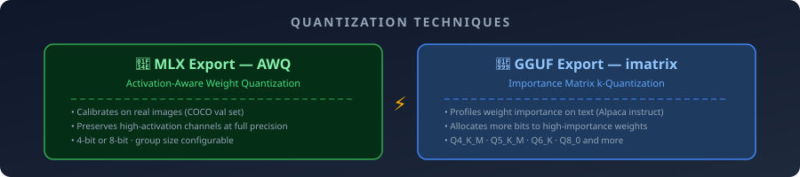
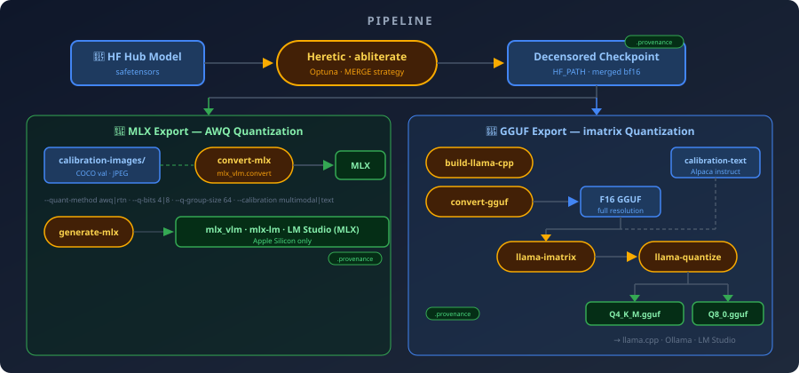
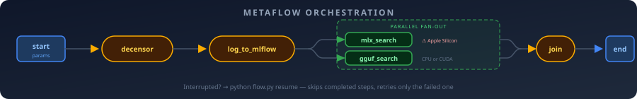

<div align="center">

<picture>
  <source media="(prefers-color-scheme: dark)" srcset="docs/assets/wellspring-hero.svg">
  
</picture>

<p>
  <a href="https://www.python.org/downloads/"></a>&nbsp;
  <a href="LICENSE"></a>&nbsp;
  <a href="https://github.com/p-e-w/heretic"></a>&nbsp;
  <a href="PROVENANCE.md"></a>&nbsp;
  <a href="CONTRIBUTING.md"></a>
</p>

**Decensor a Hugging Face model with [Heretic](https://github.com/p-e-w/heretic), quantize with AWQ or imatrix, run locally on any hardware.**

<p>
  <a href="#-quick-start"><kbd>&nbsp;Quick Start&nbsp;</kbd></a>&nbsp;
  <a href="#-pipeline"><kbd>&nbsp;Pipeline&nbsp;</kbd></a>&nbsp;
  <a href="#-compatibility"><kbd>&nbsp;Compatibility&nbsp;</kbd></a>&nbsp;
  <a href="#-provenance"><kbd>&nbsp;Provenance&nbsp;</kbd></a>&nbsp;
  <a href="COMPATIBILITY.md"><kbd>&nbsp;Full Docs&nbsp;</kbd></a>
</p>

</div>

<br>

<p align="center"></p>

## ✨ What is Wellspring?

**Wellspring** takes any Hugging Face language model, removes its refusal behavior with [Heretic](https://github.com/p-e-w/heretic)'s automatic abliteration, and exports the result to **two independent, locally-runnable formats** — each with its own state-of-the-art quantization technique:

<p align="center">
  
</p>

| Export | Quantization Technique | Calibration Data | Platform | Run with |
|--------|------------------------|------------------|----------|----------|
| **🍎 MLX** | **AWQ** — preserves high-activation channels at full precision | Real COCO images | Apple Silicon | `mlx_vlm`, `mlx-lm`, LM Studio |
| **🦙 GGUF** | **imatrix k-quants** — allocates bits proportional to weight importance | Alpaca instruction text | macOS, Linux | `llama.cpp`, Ollama, LM Studio |

The two paths never touch each other — same source in, completely separate calibration, tools, and outputs. Both techniques are data-driven: they profile the model on real data to decide *where* precision matters most, then concentrate bits there.

<br>

<p align="center"></p>

## 🚀 Quick Start

Three commands to a decensored, locally-runnable model:

> [!IMPORTANT]
> **Hardware requirements vary by model size.** The default `Qwen/Qwen3.6-35B-A3B` needs 320GB+ combined VRAM (multi-GPU) or `QUANTIZATION=BNB_4BIT`. For dev iteration, use `make dev-abliterate` with `TinyLlama` (8GB VRAM).

```bash
git clone <repo-url> && cd wellspring
make setup                    # create venv, install deps
make doctor                   # verify hardware meets requirements
make abliterate               # run heretic → decensored checkpoint
```

Then pick your export path — each uses a different data-driven quantization technique:

```bash
# 🍎 Apple Silicon → MLX (AWQ: calibrates on real images)
make calibration-data && make convert-mlx
make generate-mlx             # smoke test

# 🦙 Any platform → GGUF (imatrix: profiles weight importance on text)
make convert-gguf && make quantize-gguf
# Load in llama.cpp, Ollama, or LM Studio
```

Just want quantization? Skip decensoring and export any local model as-is — manifests are tagged `decensored=false`:

```bash
hf download "$MODEL" --revision "$MODEL_COMMIT" --local-dir models/raw   # local copy (GGUF can't read a Hub ID)
make convert-gguf quantize-gguf SKIP_DECENSOR=1 HF_PATH=models/raw
python flow.py run --skip_decensor True --hf_path models/raw               # same, via Metaflow
```

<br>

<p align="center"></p>

## 🎯 Features

<table>
<tr>
<td width="33%" valign="top">

**🔓 Automatic abliteration**<br>
Heretic's Optuna-driven search finds optimal refusal-removal parameters. No manual intervention.

</td>
<td width="33%" valign="top">

**📦 Dual export paths**<br>
MLX for Apple Silicon, GGUF for everything else. Independent calibration, independent outputs.

</td>
<td width="33%" valign="top">

**📋 Full provenance**<br>
Every artifact gets a `.provenance.json` sidecar tracking commits, seeds, and parameters.

</td>
</tr>
<tr>
<td width="33%" valign="top">

**📊 MLflow tracking**<br>
Log trials, compare runs, audit metrics. Local SQLite or hosted server — your choice.

</td>
<td width="33%" valign="top">

**🔄 Metaflow orchestration**<br>
Resumable pipeline with `python flow.py resume`. Crash recovery built in.

</td>
<td width="33%" valign="top">

**⚡ Multi-GPU support**<br>
Accelerate auto-shards across GPUs. Run the full 35B model on `p4d.24xlarge` without quantization.

</td>
</tr>
</table>

<br>

<p align="center"></p>

## 🔧 Pipeline

<p align="center">
  
</p>

Every artifact node gets a `.provenance.json` sidecar — see [PROVENANCE.md](PROVENANCE.md).

<br>

<p align="center"></p>

## 📊 Compatibility

| Model | Abliteration | MLX | GGUF | Notes |
|-------|:------------:|:---:|:----:|-------|
| `Qwen/Qwen3.6-35B-A3B` | ✅ | ✅ | ✅ | **Production default** — MoE + hybrid linear attention |
| `TinyLlama/TinyLlama-1.1B-Chat-v1.0` | ✅ | ✅ | ❌ | Dev model — [GGUF bug on dense arch](COMPATIBILITY.md#bug-ik_llama-dense-llama-crash) |

> [!NOTE]
> **For detailed compatibility info** — pinned versions, hardware requirements, architecture matrix, and known bugs — see **[COMPATIBILITY.md](COMPATIBILITY.md)**.

### Known Limitations

- **GGUF on dense Llama**: `ik_llama.cpp@401a09d2` crashes with `KeyError: 'num_experts_per_tok'` on `LlamaForCausalLM`. MoE works.
- **MLX VLM perplexity**: `mlx-lm` may not load vision-language checkpoints; text-only verified.

<br>

<p align="center"></p>

## 🏛️ Provenance

Every external dependency — code, models, datasets — is tracked with exact versions/commits.

| Document | What it covers |
|----------|----------------|
| [**PROVENANCE.md**](PROVENANCE.md) | Chain of custody: model/dataset commits, per-run manifests |
| [**THIRD_PARTY_NOTICES.md**](THIRD_PARTY_NOTICES.md) | Code licenses — includes AGPL and CC-BY-NC-4.0 flags |
| [**COMPATIBILITY.md**](COMPATIBILITY.md) | Detailed version matrix and known bugs |

> [!WARNING]
> **License flags worth reading before commercial use:**
> - `heretic-llm` is **AGPL-3.0-or-later** (invoked as subprocess)
> - `tatsu-lab/alpaca` calibration data is **CC-BY-NC-4.0**

<br>

<p align="center"></p>

## 🏗️ Governance

| Document | Role |
|----------|------|
| [**Constitution**](.specify/memory/constitution.md) | Supreme project principles — provenance, atomicity, license awareness |
| [**AGENTS.md**](AGENTS.md) | Operating guide for AI coding agents |
| [**vault/**](vault/wellspring.md) | Obsidian knowledge base — decisions, discoveries, session logs |
| [**docs/DESIGN.md**](docs/DESIGN.md) | Documentation design system — colors, SVGs, section structure |

Run `make vault-audit` to check vault integrity.

<br>

<p align="center"></p>

## 💻 Requirements

### Track A — macOS / Apple Silicon

Full pipeline: abliteration + MLX export + GGUF export.

- macOS on Apple Silicon
- Python 3.14 (`.python-version` pins this)
- Homebrew `cmake` + `ninja` for GGUF path
- Disk: ~72GB for the default model checkpoint, plus export outputs

### Track B — Linux + NVIDIA GPU

Abliteration + GGUF export only. **MLX is not available** on this track.

- Linux with NVIDIA GPU (EC2 `g5`/`p4d`/`p5`)
- Python 3.14 via `pyenv`, `uv`, or deadsnakes PPA
- `cmake` + `ninja-build`
- NVIDIA driver + CUDA toolkit

**Multi-GPU instances for full-precision runs:**
- `p4d.24xlarge` — 8× A100 40GB = 320GB VRAM
- `p5.48xlarge` — 8× H100 80GB = 640GB VRAM

Run `make doctor` to verify your hardware meets requirements.

### Disk Sizing on EC2

> [!WARNING]
> **Set `HF_HOME` before you run anything.** The model cache defaults to `~/.cache/huggingface` — if that's on a small root volume, the ~72GB download silently fills it.

```bash
export HF_HOME=/data/hf-cache   # point at whichever volume has the space
```

| Component | Size |
|-----------|------|
| HF Hub cache (`HF_HOME`) | ~72GB |
| Heretic merged output | ~72GB |
| Full-resolution GGUF (F16) | ~72GB |
| Quantized GGUFs | ~4–38GB each |
| **Total** | **~260GB minimum** |

Budget **at least 400GB** of gp3 EBS. `make doctor` checks free space.

### Dev Cycle (Cheap Iteration)

```bash
make dev-doctor      # check against TinyLlama-sized floors
make dev-abliterate  # runs against DEV_MODEL, not MODEL
```

Works on a single 8GB GPU (e.g., EC2 `g5.xlarge`).

> [!TIP]
> **Apple Silicon (MPS) hangs during abliteration** — `torch.svd_lowrank()` has no MPS kernel. Workaround: `make dev-abliterate-e2e DEVICE_MAP=cpu` (slow but works). See [COMPATIBILITY.md](COMPATIBILITY.md) for details. Track B (Linux + CUDA) is the only practical path for production models.

<br>

<p align="center"></p>

## 📈 MLflow Tracking

Set up experiment tracking before your first optimization run:

```bash
# Local SQLite (single machine)
export MLFLOW_TRACKING_URI=sqlite:///mlflow.db

# Or hosted server (team/CI)
export MLFLOW_TRACKING_URI=http://localhost:5000
```

Then run logging/optimization:

```bash
make log-abliteration-mlflow  # log Heretic trials to MLflow
make optimize-mlx             # MLX quantization search
make optimize-gguf            # GGUF quantization search
```

View results:

```bash
mlflow ui --backend-store-uri "$MLFLOW_TRACKING_URI"
```

**Re-running is safe** — logging is idempotent by design (FR-002).

<br>

<p align="center"></p>

## ⚙️ Orchestration (Metaflow)

The pipeline is also available as a Metaflow flow:

```bash
python flow.py run --model TinyLlama/TinyLlama-1.1B-Chat-v1.0 \
    --mlflow_tracking_uri sqlite:///mlflow.db
```

**Resume interrupted runs:**

```bash
python flow.py resume
```

Skips completed steps, retries only the failed step.

### Flow Graph

<p align="center">
  
</p>

| `make` target | `--only_step` | What runs |
|---------------|---------------|-----------|
| `dev-abliterate-e2e` | `decensor,log_to_mlflow` | Abliteration + logging |
| `optimize-mlx` | `mlx_search` | MLX quant search |
| `optimize-gguf` | `gguf_search` | GGUF quant search |

<br>

<p align="center"></p>

## 🛠️ Make Targets

| Target | Description |
|--------|-------------|
| `make setup` | Create venv, install deps, best-effort populate `vendor/heretic` |
| `make doctor` / `make dev-doctor` | Check hardware requirements (production / dev floors) |
| `make abliterate` | Run Heretic against `MODEL` |
| `make dev-abliterate` | Same, against `DEV_MODEL` (TinyLlama) |
| `make dev-abliterate-e2e` | Non-interactive dev abliteration via `expect` |
| `make calibration-data` | Fetch COCO images for MLX AWQ |
| `make convert-mlx` | HF → MLX format (AWQ-quantized) |
| `make generate-mlx` | Smoke test MLX output |
| `make build-llama-cpp` | Fetch + build `ik_llama.cpp` (pinned commit) |
| `make convert-gguf` | HF → full-resolution GGUF (F16) |
| `make calibration-text` | Fetch Alpaca rows for imatrix |
| `make quantize-gguf` | imatrix + quantize to `GGUF_QUANTS` |
| `make gguf` | `convert-gguf` then `quantize-gguf` (ordered) |
| `make optimize-mlx` / `make optimize-gguf` | Optuna multi-objective quant search |
| `make optimize` | Both searches (sequential or parallel per `OPTIMIZE_PARALLEL`) |
| `make log-abliteration-mlflow` | Log Heretic trials to MLflow (idempotent) |
| `make lock` | Freeze versions → `requirements-lock.txt` |
| `make notices` | Regenerate license manifest → `third_party_licenses.json` |
| `make test` | Run pytest suite |
| `make slides` / `make slides-pdf` | Render presentation deck (HTML / PDF) |
| `make paper` | Fetch pinned reference paper (Arditi et al. 2024) |
| `make clean` | Remove `.venv` |

Run `make help` for the full list with current variable values.

<br>

<p align="center"></p>

## 🎛️ Key Variables

Override on command line: `make convert-mlx Q_BITS=4`

| Variable | Default | Description |
|----------|---------|-------------|
| `MODEL` | `Qwen/Qwen3.6-35B-A3B` | HF model to abliterate |
| `MODEL_COMMIT` | unpinned | Exact Hub commit (pin for reproducibility) |
| `QUANTIZATION` | `NONE` | `NONE` or `BNB_4BIT` |
| `SEED` | `42` | Heretic optimizer seed |
| `MLFLOW_TRACKING_URI` | *(required)* | MLflow server URI — must be set before logging/optimization |
| `MLFLOW_EXPERIMENT_PREFIX` | `wellspring` | Prefix for MLflow experiment names |
| `HF_PATH` | `OUT_DIR` | Shared input to both export paths |
| `SKIP_DECENSOR` | `0` | `1` = export/search `HF_PATH` without abliteration; requires an explicit local `HF_PATH`, tags manifests `decensored=false` |
| `QUANT_METHOD` | `awq` | MLX method: `awq` or `rtn` |
| `Q_BITS` / `Q_GROUP_SIZE` | `8` / `64` | MLX quantization bit-width / group size |
| `GGUF_QUANTS` | `Q4_K_M Q8_0` | GGUF quant levels (space-separated) |
| `GGUF_F16_TYPE` | `f16` | Intermediate dtype — `f32`/`f16`/`bf16`/`auto` only |
| `LLAMA_CPP_REF` | pinned commit SHA | `ik_llama.cpp` commit to fetch |
| `GGML_CUDA` | auto-detected | `ON` if `nvidia-smi` found, else `OFF` |
| `DEVICE_MAP` / `MAX_MEMORY` | empty | Passthrough to heretic for multi-GPU tuning |
| `DEV_MODEL` | `TinyLlama/TinyLlama-1.1B-Chat-v1.0` | Dev iteration model |
| `N_TRIALS_MLX` / `N_TRIALS_GGUF` | `15` / `15` | Optuna trial budget per search |
| `OPTIMIZE_PARALLEL` | `0` | `0` = sequential, `1` = concurrent (needs separate compute) |

See the Makefile for the full list.

<br>

<p align="center"></p>

## 📋 Notes & Caveats

- **Atomic operations** — All destructive ops write to `.tmp` first, rename on success. Path variables in `rm -rf` are guarded against empty/`/`/`.`.
- **GGUF toolchain** — Uses `ik_llama.cpp` fork (not mainline `ggml-org/llama.cpp`). Mainline has bugs in hybrid linear-attention tensor conversion for Qwen3.6. Trade-off: on macOS, `llama-imatrix` runs CPU/ARM_NEON (no Metal priority); on Linux+NVIDIA, auto-detects and builds with CUDA.
- **AWQ calibration cost** — Keep `CALIB_SAMPLES` small (tens, not thousands). AWQ only needs a small diverse sample.
- **Reproducibility** — `SEED` seeds Python/NumPy/PyTorch/Optuna but GPU float reduction order isn't deterministic. Treat re-runs as "very likely the same, not byte-for-byte guaranteed."
- **`GGUF_F16_TYPE` is restricted** — `convert-gguf` rejects quantized outtypes; the two-stage design requires a full-resolution source.
- **`--export-strategy MERGE` is hardcoded** — edit the Makefile recipe directly for `ADAPTER`.
- **`vendor/heretic` is optional** — a reference copy for local tooling, not the runtime. The pipeline runs `heretic-llm` from PyPI.
- **`.gitignore` covers defaults only** — overriding output paths may require manual `.gitignore` entries.
- **License flags** — `heretic-llm` is **AGPL-3.0-or-later** (subprocess), `tatsu-lab/alpaca` is **CC-BY-NC-4.0**. See `THIRD_PARTY_NOTICES.md`.

<br>

<p align="center"></p>

## 📚 Additional Resources

| Resource | Description |
|----------|-------------|
| [**presentation/**](presentation/abliteration.md) | Conference talk: 45 slides, 16 animated SVG diagrams. Build: `make slides` |
| [**presentation/DESIGN.md**](presentation/DESIGN.md) | Slide deck design system and diagram splice procedure |
| [**docs/DESIGN.md**](docs/DESIGN.md) | Documentation design system — colors, SVGs, section conventions |
| [**vault/**](vault/wellspring.md) | Obsidian knowledge base: decisions, discoveries, session logs |
| [**CONTRIBUTING.md**](CONTRIBUTING.md) | How to contribute — dev setup, PR process, code standards |
| [**AGENTS.md**](AGENTS.md) | Operating guide for AI coding agents |
| [**.specify/memory/constitution.md**](.specify/memory/constitution.md) | Project governance principles |

<br>

<p align="center"></p>

<p align="center">
  <sub>Built with <a href="https://github.com/p-e-w/heretic">Heretic</a> · <a href="https://github.com/ikawrakow/ik_llama.cpp">ik_llama.cpp</a> · <a href="https://github.com/Blaizzy/mlx-vlm">mlx-vlm</a> · Contributions welcome!</sub>
</p>
