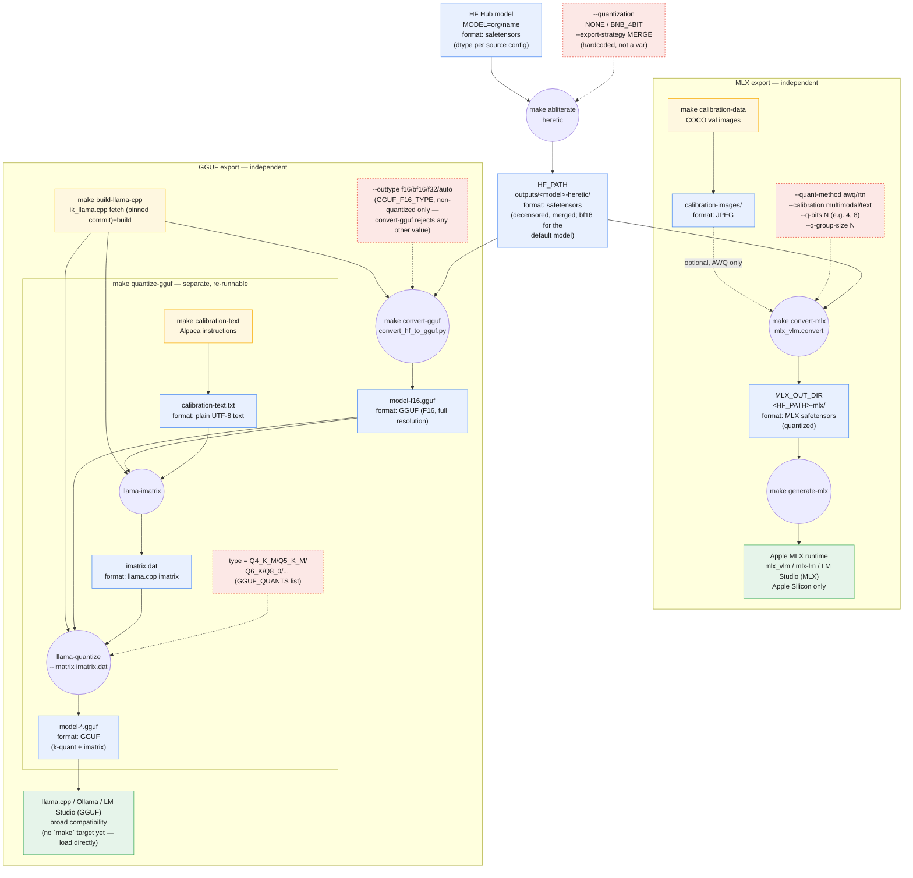

# Wellspring: Heretic → MLX / GGUF Export Pipeline

Decensors a Hugging Face language model with [Heretic](https://github.com/p-e-w/heretic)
(automatic abliteration), then exports the result to two independent,
locally-runnable formats:

- **MLX** — quantized via mlx-vlm's AWQ calibration, for Apple Silicon (`mlx_vlm` / `mlx-lm` / LM Studio's MLX backend)
- **GGUF** — imatrix-quantized via [`ik_llama.cpp`](https://github.com/ikawrakow/ik_llama.cpp), for `llama.cpp` / Ollama / LM Studio's GGUF backend

The two export paths never feed into each other — same source checkpoint in, completely separate calibration data, tools, and output directories.

## Provenance & attribution

For external audits: every external code, model, and dataset dependency
this pipeline touches — exact versions/commits, licenses, and reproduction
steps — is documented in **[`PROVENANCE.md`](PROVENANCE.md)** (chain of
custody: model/dataset commits, per-run manifests) and
**[`THIRD_PARTY_NOTICES.md`](THIRD_PARTY_NOTICES.md)** (code dependencies
and their licenses, including one AGPL and one CC-BY-NC-4.0 flag worth
reading before commercial use). `make lock` and `make notices` regenerate
the two machine-readable artifacts those documents summarize
(`requirements-lock.txt`, `third_party_licenses.json`).

## Requirements

- macOS on Apple Silicon (MLX conversion needs it; the abliteration step uses the Metal backend)
- Python 3.14 (`.python-version` pins this; install via `brew install python@3.14` if needed)
- Homebrew `cmake` + `ninja` — only needed for the GGUF export path (`make build-llama-cpp`)
- Disk: the heretic checkpoint alone is ~72GB (bf16) for the default model (`Qwen/Qwen3.6-35B-A3B`); budget for that plus whichever export(s) you run (MLX quantized copy, and/or GGUF F16 + quantized copies)

## Quick start

```sh
make setup                                     # create ./.venv, install requirements.txt
make abliterate                                # run heretic against MODEL (default: Qwen/Qwen3.6-35B-A3B)
```

`heretic` will interactively ask what to do with the result near the end of
the run (save/upload/chat/benchmark) — choose save, then enter a path (a
natural choice is the one `make help`/the command output suggests). It will
**not** ask you to choose merge-vs-adapter — that's already fixed by
`--export-strategy MERGE` in the Makefile.

Then pick one or both export paths:

```sh
make calibration-data && make convert-mlx      # -> MLX_OUT_DIR, for Apple Silicon
make convert-gguf && make quantize-gguf        # -> GGUF_OUT_DIR, for llama.cpp/Ollama/LM Studio
                                                # (or just `make gguf` to run both in one go)
```

`convert-gguf` and `quantize-gguf` are deliberately separate: `convert-gguf`
does the expensive HF→GGUF pass once and writes a full-resolution
(unquantized) GGUF; `quantize-gguf` reads that file back in and produces the
actual quant levels (`GGUF_QUANTS`, default `Q4_K_M Q8_0`). Want a different
quant level later? Re-run `make quantize-gguf GGUF_QUANTS="..."` — it never
repeats the expensive conversion.

Smoke-test the MLX output:

```sh
make generate-mlx
```

(GGUF has no `make` runtime target yet — load `GGUF_OUT_DIR/model-Q4_K_M.gguf` etc. directly in `llama.cpp`, Ollama, or LM Studio.)

## Pipeline



Every artifact node above (`HF`, `MLX`, `F16`, `GQ`, `CI`, `CTF`) also gets
a sidecar `<name>.provenance.json` recording exactly what produced it
(commits, seeds, parameters) — see [`PROVENANCE.md`](PROVENANCE.md).

## Makefile targets

| Target | Does |
|---|---|
| `make setup` | Create `./.venv` (Python 3.14) and install `requirements.txt` |
| `make venv` / `make install` | Granular halves of `setup` |
| `make abliterate` | Run `heretic` against `MODEL` with merge pre-selected; you still interactively choose to save and enter a path |
| `make calibration-data` | Fetch `CALIB_SAMPLES` real COCO images into `calibration-images/`, for MLX AWQ calibration |
| `make convert-mlx` | Convert `HF_PATH` → MLX format (`MLX_OUT_DIR`), AWQ-quantized by default |
| `make generate-mlx` | Smoke-test the MLX output with a short generation |
| `make build-llama-cpp` | Fetch (pinned commit) + build `ik_llama.cpp` (`llama-imatrix`, `llama-quantize`) |
| `make convert-gguf` | Convert `HF_PATH` → full-resolution `GGUF_F16_GGUF` (no quantization); rejects a quantized `GGUF_F16_TYPE` |
| `make calibration-text` | Fetch `CALIB_TEXT_SAMPLES` chat/instruction rows into `calibration-text.txt`, for GGUF imatrix calibration |
| `make quantize-gguf` | imatrix + quantize `GGUF_F16_GGUF` → `GGUF_QUANTS` levels in `GGUF_OUT_DIR`; re-runnable with a different `GGUF_QUANTS` without repeating `convert-gguf` |
| `make gguf` | `convert-gguf`, then (strictly after, even under `make -j`) `quantize-gguf` |
| `make lock` | Freeze exact installed package versions → `requirements-lock.txt` |
| `make notices` | Regenerate the full third-party license manifest → `third_party_licenses.json` |
| `make clean` | Remove `./.venv` |

Run `make help` any time for the same summary with your current variable values resolved in.

## Key variables

All have sane defaults; override on the command line, e.g. `make convert-mlx Q_BITS=4`.

| Variable | Default | Meaning |
|---|---|---|
| `MODEL` | `Qwen/Qwen3.6-35B-A3B` | HF model to abliterate |
| `MODEL_COMMIT` | `null` (unpinned) | Exact Hub commit of `MODEL` — deliberately not pinned by default (a fixed SHA is only valid for one specific `MODEL`); see `PROVENANCE.md` §2 for the commit matching the default model |
| `QUANTIZATION` | `NONE` | Heretic load-time quantization (`NONE` \| `BNB_4BIT`) |
| `SEED` | `42` | Heretic's optimizer seed (fixed for reproducible/idempotent re-runs) |
| `GOOD_PROMPTS_COMMIT` / `BAD_PROMPTS_COMMIT` / `GOOD_EVAL_PROMPTS_COMMIT` / `BAD_EVAL_PROMPTS_COMMIT` | pinned commit SHAs | Heretic's own internal optimization/evaluation prompt datasets — see `PROVENANCE.md` §3 |
| `HF_PATH` | `OUT_DIR` (heretic's output) | Shared input to both export paths |
| `QUANT_METHOD` | `awq` | MLX quantization method (`awq` \| `rtn`) |
| `CALIBRATION` | `multimodal` | MLX calibration mode (`multimodal` \| `text`) |
| `Q_BITS` / `Q_GROUP_SIZE` | `8` / `64` | MLX quantization bit-width / group size |
| `CALIB_DATASET` / `CALIB_SPLIT` / `CALIB_SAMPLES` / `CALIB_REVISION` | `detection-datasets/coco` / `val` / `64` / pinned commit | Source for `calibration-images/` — see `PROVENANCE.md` §4 |
| `GGUF_QUANTS` | `Q4_K_M Q8_0` | GGUF quant levels to produce (space-separated list, must be non-empty) |
| `GGUF_F16_TYPE` | `f16` | Intermediate dtype before quantizing — must be `f32`/`f16`/`bf16`/`auto`; `convert-gguf` rejects anything else (an already-quantized outtype would defeat the two-stage design) |
| `GGUF_F16_GGUF` | `GGUF_OUT_DIR/model-<type>.gguf` | Path `quantize-gguf` reads back in; override to point at an existing conversion |
| `CALIB_TEXT_DATASET` / `CALIB_TEXT_SPLIT` / `CALIB_TEXT_SAMPLES` / `CALIB_TEXT_REVISION` | `tatsu-lab/alpaca` / `train` / `100` / pinned commit | Source for `calibration-text.txt` — **`tatsu-lab/alpaca` is CC-BY-NC-4.0, see `PROVENANCE.md` §4** |
| `LLAMA_CPP_REF` | a pinned commit SHA | `ik_llama.cpp` commit `build-llama-cpp` fetches — not the moving default branch |

See the `Makefile` itself for the full list and inline rationale comments.

## Notes & caveats

- **Destructive operations are atomic and safe to re-run.** `convert-mlx`,
  `convert-gguf`, and `quantize-gguf`'s imatrix step all write to a sibling
  `.tmp` path/directory first and only replace the previous output via a
  final rename/swap *after* the tool exits successfully — a failed or
  interrupted run (or a missing `mlx_vlm`/`llama-quantize` binary) never
  destroys a previously-good artifact. `quantize-gguf` additionally writes
  every requested quant level to a `.tmp` name, and only clears stale
  levels from a previous, differently-configured run (and renames the new
  ones into place) once *every* requested level has succeeded — a mid-loop
  failure now correctly aborts and reports an error (via `set -e`) instead
  of silently reporting success with a missing quant. Path variables used
  in `rm -rf` (`VENV`, `MLX_OUT_DIR`, `LLAMA_CPP_DIR`) are guarded against
  being empty or `/`/`.` before anything is deleted.
- **`gguf`'s ordering is explicit, not just prerequisite order.** `quantize-gguf`
  is invoked from `gguf`'s recipe (`$(MAKE) quantize-gguf`) rather than
  listed as a second prerequisite, specifically so `make -j gguf` can't run
  it concurrently with `convert-gguf` — Make has no file-based edge between
  two phony targets, so two prerequisites of one target are fair game for
  parallel execution under `-j` even though `quantize-gguf`'s runtime
  existence-check for the F16 file assumes `convert-gguf` already finished.
- **`abliterate`'s `SEED` improves but doesn't guarantee bit-exact reproducibility.**
  It's passed straight to Heretic's `--seed`, which seeds Python's `random`,
  NumPy, PyTorch, and Optuna — removing the dominant source of run-to-run
  variance (Optuna's search order) — but floating-point reduction order on
  GPU/Metal kernels isn't something a seed controls. `MODEL_COMMIT` still
  defaults to unpinned (see above); heretic's 4 internal prompt datasets are
  pinned by default. Treat re-runs as "very likely the same, not
  byte-for-byte guaranteed."
- **`GGUF_F16_TYPE` is intentionally restricted.** `convert_hf_to_gguf.py`
  accepts quantized `--outtype` choices too (`q8_0`, `q4_0`, ...), but
  `quantize-gguf` expects to run `llama-quantize` against a *full-resolution*
  source — quantizing an already-quantized file defeats the point of the
  two-stage design, so `convert-gguf` explicitly rejects anything other than
  `f32`/`f16`/`bf16`/`auto`.
- **GGUF toolchain choice**: uses the `ik_llama.cpp` fork rather than mainline `ggml-org/llama.cpp`.
  Mainline has open bugs in the hybrid linear-attention tensor conversion that
  `Qwen3.6-35B-A3B`'s architecture uses; `ik_llama.cpp` has dedicated, verified
  support for this model family. Trade-off: `ik_llama.cpp` does not prioritize
  Metal, so `llama-imatrix` runs on CPU/ARM_NEON (well-supported, just slower
  than GPU offload). `build-llama-cpp` fetches a **pinned commit** (`LLAMA_CPP_REF`),
  not the moving default branch, so a from-scratch clone always reproduces
  the same tested toolchain instead of whatever happens to be tip-of-branch
  on a given day.
- **AWQ calibration cost**: `mlx_vlm.convert`'s AWQ path forwards every file in
  `calibration-images/` through the full model, unbatched, with no cap — keep
  `CALIB_SAMPLES` small (tens, not thousands). AWQ only needs a small, diverse
  sample to estimate per-channel activation scale. `convert-mlx` only passes
  `--calibration-data` when that directory actually contains at least one
  file (not merely when the path exists — an empty directory is treated the
  same as a missing one).
- Both `scripts/fetch_calibration_*.py` scripts reject `--samples <= 0`,
  URL-encode their datasets-server query parameters, apply an explicit
  network timeout to every request (including per-image downloads), and
  write their output atomically (temp path, then rename/swap) — a stalled
  download or a mid-run failure leaves the previous calibration set intact
  rather than a partially-overwritten one.
- **`--export-strategy MERGE` is hardcoded** in `abliterate`, not exposed as a
  Makefile variable — edit the recipe directly if you want the `ADAPTER`
  strategy instead.
- **Known limitation — dependency/data pinning, current state.** `ik_llama.cpp`,
  heretic's 4 internal prompt datasets, and this project's 2 calibration
  datasets are all pinned to exact commits by default (see `PROVENANCE.md`).
  `MODEL_COMMIT` is deliberately left unpinned by default (§2 of
  `PROVENANCE.md` explains why) — pin it explicitly per run if you need it.
  `requirements.txt` still uses version ranges (for compatible-fix pickup);
  run `make lock` to capture the exact versions actually installed into
  `requirements-lock.txt` for a given run. GPU/Metal floating-point
  execution order remains outside anything this pipeline controls.
- **Known limitation — `.gitignore` covers the default paths, not overrides.**
  If you override `CALIBRATION_DATA`, `CALIB_TEXT_FILE`, `LLAMA_CPP_DIR`, or
  point `MLX_OUT_DIR`/`GGUF_OUT_DIR` somewhere outside `outputs/`, that
  custom path isn't automatically git-ignored — check `git status` before
  committing if you've overridden any of these.
- Model, calibration, and GGUF artifacts are all git-ignored by default
  (`outputs/`, `calibration-images/` (+ its `.tmp` sibling), `calibration-text.txt`
  (+ its `.tmp` sibling), `ik_llama.cpp/`, `*.gguf`, etc.) — nothing here is
  meant to be committed.
