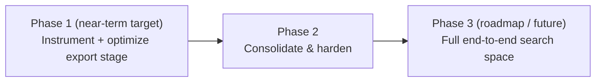

# Wellspring Roadmap: Parameterized, Tracked, Evolutionarily-Optimized Pipeline

This document is the human-readable roadmap for expanding Wellspring's Heretic → MLX/GGUF
pipeline (see [`README.md`](README.md) for how the pipeline works today) into a
system where every stage is **parameterized**, every run is **tracked as an
MLflow experiment**, and an **evolutionary/Bayesian optimizer** searches those
parameters to maximize evaluation metrics on the *final, exported runtime
formats* (MLX and GGUF) - not just on the pre-export checkpoint.

For the fully detailed, execution-ready engineering plan behind Phase 1 below
(with references, acceptance criteria, and QA per task), see
[`.omo/plans/evolutionary-pipeline-optimization-roadmap.md`](.omo/plans/evolutionary-pipeline-optimization-roadmap.md).
This roadmap is the narrative overview; that file is what an implementer
actually executes against.

## The key finding that shapes this roadmap

Before writing this roadmap, we checked what already exists rather than
assuming. The result changed the plan for the better:

**Heretic already runs its own evolutionary/Bayesian optimizer.** The
`heretic` tool this pipeline already depends on (`requirements.txt`) doesn't
just decensor a model once with fixed settings - it runs an internal
[Optuna](https://optuna.org/) study (TPE sampler, 200 trials by default) that
automatically searches abliteration parameters to co-minimize refusals and
quality loss (KL divergence), and it already depends on `optuna` and
[`lm-eval`](https://github.com/EleutherAI/lm-evaluation-harness) internally.

So the "apply an evolutionary optimizer to maximize eval metrics" part of the
goal is **already solved for the abliteration stage**. What's actually
missing - and what this roadmap is really about - is:

1. **Visibility**: none of Heretic's internal search is tracked anywhere
   outside its own local checkpoint file. Nothing shows up in MLflow.
2. **The export/quantization stage has zero optimization or tracking at
   all.** Today you pick `Q_BITS`, `GGUF_QUANTS`, etc. by hand and hope. No
   automated search has ever run over these parameters.
3. **Nothing evaluates the actual compressed output.** Heretic scores its
   own in-memory, uncompressed model. Once that model is quantized into an
   MLX or GGUF file, nothing checks whether it's still as smart (perplexity)
   or still as decensored (refusal rate) as before compression. That gap -
   evaluating the *real, shippable artifact* - is the crux of this whole
   effort.

## Phase ordering & feature release order

### Phase 1 - Near-term implementation target ✅ *planned in detail, ready to execute*

Two **independent** Optuna+MLflow studies, one per export format, each
searching that format's quantization parameters against **one fixed**
Heretic checkpoint. Heretic's own search is reused as-is (not re-run per
trial) and simply made visible in MLflow after the fact.

| # | Item | What it delivers | New tools/deps |
| --- | --- | --- | --- |
| 1.1 | Dependencies & config | `mlflow`, `optuna`, `mlx-lm` added; `MLFLOW_TRACKING_URI` required config surface | `mlflow`, `optuna`, `mlx-lm` |
| 1.2 | Shared refusal-rate driver | One reusable "is this a refusal?" check, reusing Heretic's own proven keyword list, usable against *either* format | none (pure Python) |
| 1.3 | GGUF perplexity eval | Wraps the `llama-perplexity` binary (already built in this repo's `ik_llama.cpp/`) against a real quantized `.gguf` file | none - already built |
| 1.4 | MLX perplexity eval | New perplexity computation for a real quantized MLX model | `mlx-lm` |
| 1.5 | Heretic → MLflow ingestion | Every abliteration run's internal Optuna trials become visible in MLflow, read after the fact from Heretic's own checkpoint file - no changes to Heretic itself | `mlflow` |
| 1.6 | MLX quantization study | New automated search over `Q_BITS`/`Q_GROUP_SIZE`/`QUANT_METHOD`/`CALIBRATION`/`CALIB_SAMPLES`, scored on perplexity + refusal-rate of the real exported MLX file, tracked in MLflow | `optuna`, `mlflow` |
| 1.7 | GGUF quantization study | Same idea for GGUF: one quant level per search attempt from `GGUF_QUANTS`'s candidates + calibration sample count, scored the same way | `optuna`, `mlflow` |
| 1.8 | Makefile + README polish | New `make optimize-mlx` / `make optimize-gguf` / `make optimize` / `make log-abliteration-mlflow` targets, documented like every existing target | none |

**What Phase 1 explicitly does NOT do:** it doesn't touch Heretic's source
code, doesn't re-run abliteration per search attempt, doesn't mutate the
datasets fed into abliteration, and doesn't pick an MLflow server for you -
you supply `MLFLOW_TRACKING_URI`.

### Phase 2 - Consolidate & harden

Once Phase 1 is running and producing real MLflow data, the next round of
work is about making it trustworthy and pleasant to use rather than adding
new search dimensions:

- **Cross-study dashboards**: group an abliteration run + its two downstream
  quantization studies under one MLflow parent run/experiment, so a single
  model's whole journey (decensor → compress → evaluate) is browsable
  together.
- **Pareto-front reporting**: both studies already use a multi-objective
  sampler (Optuna's NSGA-II) rather than collapsing quality and
  decensoring-retention into one number - Phase 2 adds proper Pareto-front
  visualization/export so you can pick a point on the quality/decensoring
  tradeoff curve instead of just a single "winner."
- **Live instrumentation upgrade (optional)**: Heretic ships a documented
  plugin system (`Scorer` plugins) that runs *during* its own search, not
  just after. Phase 1's MLflow ingestion reads Heretic's results after the
  run finishes; Phase 2 investigates upgrading that to a live, per-trial
  hook, so an abliteration run's progress is visible in MLflow in real time
  while it's still running.

### Phase 3 - Full end-to-end search space (future / long-horizon roadmap)

This is the part of the original ask that goes beyond quantization
parameters and starts letting the evolutionary optimizer reach further back
into the pipeline - explicitly deferred, on your instruction, so Phase 1
stays small and affordable (~10-20 search attempts) while this phase is
scoped out separately once Phase 1's results are in hand:

- **Corpus/dataset mutation**: today the datasets used for abliteration
  (`good-prompts`/`bad-prompts`) and calibration (COCO images, Alpaca text)
  are fixed defaults. This phase treats *which datasets, and which samples
  from them* as additional search dimensions in their own right, rather than
  a fixed input.
- **Outer search over Heretic's own meta-settings**: things like the KL-divergence
  target, row-normalization mode, and winsorization quantile are today fixed
  command-line settings for a `make abliterate` run, not something Heretic's
  own internal search explores. This phase wraps Heretic itself in an outer
  search over those settings - expensive (each attempt re-runs a full,
  multi-hour abliteration), so it's scoped as its own later effort with its
  own budget conversation.
- **Joint MLX+GGUF multi-objective search**: Phase 1 keeps the two formats'
  studies independent, as requested. This phase explores whether a single
  joint search (one Pareto front spanning both formats) is worth the added
  complexity.
- **Any other input mutation** that surfaces as valuable once Phase 1/2 are
  in production use.

## Status

- **Phase 1**: planned in full engineering detail, not yet implemented. See
  [`.omo/plans/evolutionary-pipeline-optimization-roadmap.md`](.omo/plans/evolutionary-pipeline-optimization-roadmap.md)
  for the 8-task execution plan with references, acceptance criteria, and QA.
- **Phase 2 & 3**: intentionally not planned in engineering detail yet - they
  are roadmap placeholders to be scoped once Phase 1 ships and its real
  MLflow data is available to inform the next decisions.

## Hardware-aware export dispatch (separate track, orthogonal to Phases 1-3)

The optimization phases above answer *what parameters* to search over.
This track answers a different question: *where* each pipeline stage
physically runs, and how a checkpoint gets there without a human manually
SSHing into the right box and invoking the right `make` target.

**Today**: `make abliterate` produces one checkpoint. A human decides which
export(s) to run, then manually invokes `make convert-mlx` on a Mac and/or
`make convert-gguf && make quantize-gguf` on a Linux/NVIDIA host - each a
separate, manually-triggered `make` invocation on whichever machine happens
to have the right hardware (see README's "Requirements" Track A/B split).

**Target shape**: one invocation - or one automatic trigger on abliteration
completion - that abliterates once, then gets the resulting checkpoint to
both export targets and runs each export on whichever hardware it actually
needs, without a human re-choreographing "which command on which box."

Why this can't just be "add a workflow orchestrator": evaluated against
Metaflow specifically (see session notes) - `@batch`/`@kubernetes` are
Linux-container-only, and a Mac can only ever be the *launcher* of a
Metaflow run, never a remote execution target for it
(confirmed against `docs.metaflow.org`'s own driver-install docs, which
describe launching `@kubernetes` runs *from* a Mac, never running a step
*on* one). MLX's Apple-Silicon requirement means this constraint doesn't
go away by picking a different off-the-shelf orchestrator - it has to be
designed for directly.

**Staging** (deliberately incremental, per Article VI/YAGNI - no infra is
provisioned until a concrete need exists):

1. **Stage A (near-term target once scoped):** direct machine-to-machine
   checkpoint transfer (rsync/scp, or a shared network filesystem where
   available) between the abliteration host and each export host - no new
   third-party storage dependency. Dispatch itself is **parameterized**,
   not hardcoded to one trigger model: the same mechanism must support
   (a) automatic dispatch the moment `make abliterate` finishes, and
   (b) a manual, single-command fan-out a human runs later against an
   already-saved checkpoint. Target hosts are addressed generically
   (whatever's reachable today - a specific SSH-reachable box); this stage
   does **not** build cloud provisioning/autoscaling logic, since no
   ephemeral compute target exists yet to provision.
2. **Stage B (roadmap only, not scoped in detail yet):** shared object
   storage (e.g. S3) as an additional or alternative transfer backend,
   revisited if/when a hosted export target stops being a fixed,
   directly-reachable machine (e.g. ephemeral/on-demand compute that isn't
   SSH-reachable ahead of time). Not needed for Stage A's known targets.

**Explicitly out of scope until it's a real, present requirement (Article
VI):** cloud instance provisioning/autoscaling, any specific ephemeral
compute provider integration, and any change to how MLX/GGUF export
*parameters* are chosen (that's Phases 1-3 above, unaffected by where the
export physically runs).
